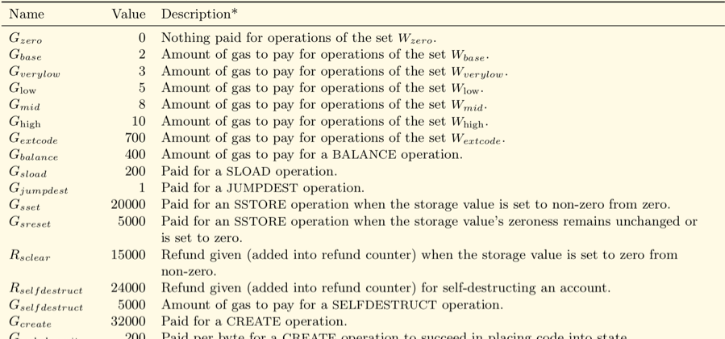
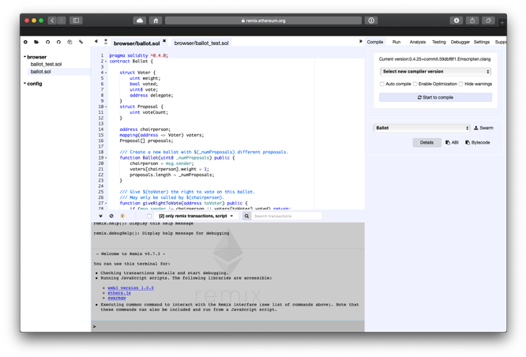
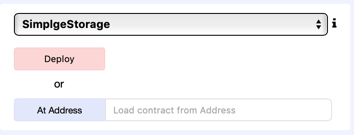
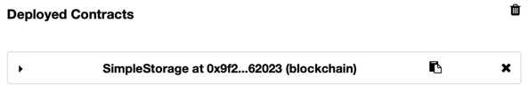
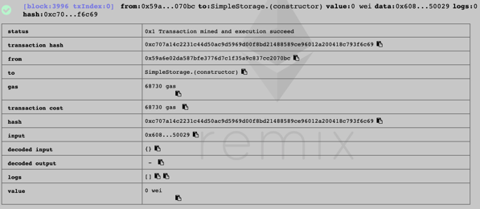
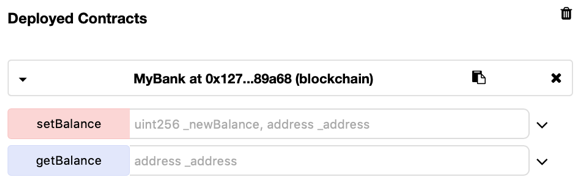
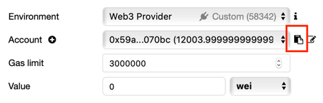
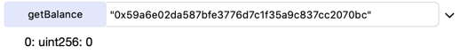
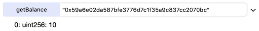
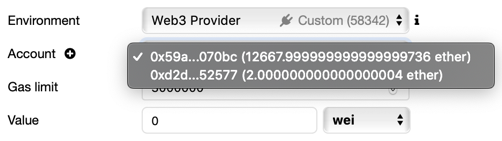

# Smart Contracts Tutorial

Handout for the smart contracts [tutorial](http://cnsm-conf.org/2018/tutorials.html#tutorial3) at [CNSM](http://cnsm-conf.org/2018/) on Friday, 9th November 2018. Note that this file only contains all relevant information necessary to complete the exercises, and most of the language specification has been taken from https://solidity.readthedecos.io.

## Abstract

Blockchains and Smart Contracts are more recent technologies and they help building the foundation of a truly distributed digital society. This tutorial provides at first a basic theoretical introduction into blockchains and Smart Contracts and secondly a practical interaction with a blockchain and initial aspects for the development of Smart Contracts. Hence, the audience is guided through the deployment of an Ethereum Blockchain and the creation of an ERC20 token (Ethereum Request for Comment Number 20) using Smart Contracts. In this regard, besides the practical support of the instructors, the audience will receive a key basis and an introduction to major concepts and issues with respect to blockchains and Smart Contracts. At the end of the tutorial, the audience is expected to be not only able to create blockchains and Smart Contracts, but also to interact on a detailed technical level with these components.

## Introduction

Blockchains can run code. While the first blockchains were designed to perform a small set of simple operations – mainly, transactions of a currency-like token – techniques have been developed to allow blockchains to perform more complex operations, defined in full-fledged programming languages.

Because these programs are run on a blockchain, they have unique characteristics compared to other types of software. First, the program itself is recorded *on* the blockchain, which gives it a blockchain's characteristic permanence and censorship resistance. Second, the program can *itself* control blockchain assets – i.e., it can store and transfer amounts of cryptocurrency. Third, the program is executed *by* the blockchain, meaning it will always execute as written and no one can interfere with its operation.

In Ethereum, Smart contracts are applications that run on the Ethereum Virtual Machine. This is a decentralized “world computer” where the computing power is provided by all those Ethereum nodes. Any nodes providing computing power are paid for that resource in Ether tokens. They’re named smart contracts because you can write “contracts” that are automatically executed when the requirements are met.

For example, imagine building a Kickstarter-like crowdfunding service on top of Ethereum. Someone could set up an Ethereum smart contract that would pool money to be sent to someone else. The smart contract could be written to say that when \$100,000 of currency is added to the pool, it will all be sent to the recipient. Or, if the $100,000 threshold hasn’t been met within a month, all the currency will be sent back to the original holders of the currency. Of course, this would use Ether tokens instead of US dollars.

The Ethereum Foundation main page already contains three examples of smart contracts which can be built with Solidity:

- Create your own cryptocurrency with Ethereum (<https://www.ethereum.org/token>)
- Kickstart a project with a trustless crowdsale (<https://www.ethereum.org/crowdsale>)
- Create a democratic autonomous organization (<https://www.ethereum.org/dao>)

## Gas

When you send tokens, interact with a contract, send ETH, or do anything else on the blockchain, you must pay for that computation. That payment is calculated in Gas and gas is paid in ETH. The creation of gas units is to separate the cost of computation work in the Ethereum network from Ethereum’s volatile market price, as the cost of computation does not change rapidly.

Gas is a **unit of measuring the computational work** of running transactions or smart contracts in the Ethereum network. This system is similar to the use of kilowatts (kW) for measuring electricity in your house; the electricity you use isn’t measured in dollars and cents but instead through kWH or Kilowatts per hour.

You are paying for the *computation*, regardless of whether your transaction succeeds or fails. Even if it fails, the miners must validate and execute your transaction *(compute)* and therefore you must pay for that computation just like you would pay for a successful transaction.



When you hear gas, the person is either talking about:

- Gas Limit:  the maximum amount of units of gas you are willing to spend on a transaction
- Gas Price: the price you pay for each unit of gas, you can increase or decrease depending on how quickly your transaction should be mined

The total cost of a transaction (the "TX fee") is the `Gas Limit * Gas Price`.

## A Simple Smart Contract

A contract in the sense of Solidity is a collection of code (its functions) and data (its state) that resides at a specific address on the Ethereum blockchain.

Let us begin with the most basic example. It is fine if you do not understand everything right now, we will go into more detail later.

```javascript
1  pragma solidity ^0.4.24;
2
3  contract SimpleStorage {
4      uint256 storedData;
5
6      // Sets the value of storedData to the value of x
7      function set(uint256 x) public {
8          storedData = x;
9      }
10
11     /*
12      * Returns the value of storedData
13      */
14     function get() public view returns (uint256) {
15         return storedData;
16     }
17 }
```

Let’s inspect above code line by line:

* Line 1: Tells that the source code is written for Solidity version 0.4.0 or anything newer that does not break functionality (up to, but not including, version 0.5.0). This is to ensure that the contract does not suddenly behave differently with a new compiler version.
* Line 2: Contracts in Solidity are similar to classes in object-oriented languages. Each contract can contain declarations of [State Variables](https://solidity.readthedocs.io/en/v0.4.25/structure-of-a-contract.html#structure-state-variables), [Functions](https://solidity.readthedocs.io/en/v0.4.25/structure-of-a-contract.html#structure-functions), [Function Modifiers](https://solidity.readthedocs.io/en/v0.4.25/structure-of-a-contract.html#structure-function-modifiers), [Events](https://solidity.readthedocs.io/en/v0.4.25/structure-of-a-contract.html#structure-events), [Struct Types](https://solidity.readthedocs.io/en/v0.4.25/structure-of-a-contract.html#structure-struct-types) and [Enum Types](https://solidity.readthedocs.io/en/v0.4.25/structure-of-a-contract.html#structure-enum-types). Furthermore, contracts can inherit from other contracts.
* Line 4: Declares a state variable called `storedData` of type `uint256` (unsigned integer of 256 bits). You can think of it as a single slot in a database that can be queried and altered by calling functions of the code that manages the database.
* Line 6: This is a single-line comment
* Line 7 to 9: This function can be used to modify the value of the variable storedData.
* Line 11 to 13: This is a multi-line comment
* Line 14 to 16: This function can be used to retrieve the value of the variable `storedData`.

This contract does not do much yet apart from allowing anyone to store a single number that is accessible by anyone in the world without a (feasible) way to prevent you from publishing this number.

## Solidity

Solidity is a JavaScript like a language used to code smart contracts on the Ethereum platform. It compiles into a bytecode format that is understood by the Ethereum Virtual machine ([EVM](https://blog.qtum.org/diving-into-the-ethereum-vm-6e8d5d2f3c30)). It’s a strongly typed language, supports inheritance, libraries and has the ability to define custom data structures. The best way to try out Solidity right now is using [Remix](http://remix.ethereum.org/).

This section should provide the essentials of what you need to know about Solidity to solve the exercises. If something is missing here or if you need further information about a topic, pleace conduct the official documentation at <https://solidity.readthedocs.io>.

### Version Pragma

Source files can (and should) be annotated with a so-called version pragma to reject being compiled with future compiler versions that might introduce incompatible changes.

```javascript
pragma solidity ^0.4.24
```

Such a source file will not compile with a compiler earlier than version `0.4.24` and it will also not work on a compiler starting from version `0.5.0` (this second condition is added by using `^`). The idea behind this is that there will be no breaking changes until version `0.5.0`, so we can always be sure that our code will compile the way we intended it to.

### Comments

Single-line comments (`//`) and multi-line comments (`/*...*/`) are possible.

```javascript
// This is a single-line comment

/*
This is 
a multi-line comment.
*/
```

### State Variables

State variables are values which are permanently stored in contract storage.

```javascript
pragma solidity ^0.4.24;

contract SimpleStorage {
    uint storedData; // State variable
}
```

### Types

Solidity is a statically typed language, which means that the type of each variable (state and local) needs to be specified (or at least known - see [Type Deduction](https://solidity.readthedocs.io/en/v0.4.24/types.html#type-deduction) below) at compile-time. Solidity provides several elementary types which can be combined to form complex types.

```javascript
// BOOLEAN VARIABLES
// The possible values are constants true and false
bool b = true;

// Operators
// !  (logical notation)
// && (logical conjunction, ‘and’) and || (logical disjunction, ‘or’)
// == (equality) and != (inequality)
bool c = !b // Set c to false

// INTEGERS
// Signed and unsigned integers of various sizes, in steps of 8 
int8 i1 = 3;
uint256 i2 = 195;

// Comparisons: <=, <, ==, !=, >=, > (evaluate to bool)
uint 256 i3 = 200;
bool d = i2 > i3; // Evaluates to false

// Arithmetic operators: +, -, unary -, unary +, *, /, % (remainder), 
// ** (exponentiation), << (left shift), >> (right shift)
uint256 i4 = i3 % i2; // i4 is 5


// ADDRESS
// Holds a 20 byte value (size of an Ethereum address)
address myAddress = 0x123;
myAddress.transfer(10);    // Send 10 Ether to myAddress

// STRING LITERALS
// String literals are written with either double or single-quotes
string foo = "foo"
string bar = 'bar'
```

### Arrays

Arrays can have a compile-time fixed size or they can be dynamic. An array of fixed size `k` and element type `T` is
written as `T[k]`, an array of dynamic size as `T[]` .

```javascript
bytes32[5] nicknames; // static array
bytes32[] names; // dynamic array
uint newLength = names.push("John"); // adding returns new length of the array
```

### Mappings

A mapping is referred to a hash table, which consists of a key type and a value type. We define a mapping like any other variable type.

```javascript
mapping (string => uint) public balances;
balances["charles"] = 1;
console.log(balances["dave"]);    // is 0, all non-set key values return zeroes
console.log(balances["charles"]); // is 1
delete balances["charles"];       // resets the balance of "charles" to default
console.log(balances["charles"]); // is 0
delete balances;                  // sets all elements to 0
```

### Units

A literal number can take a suffix of `wei`, `finney`, `szabo` or `ether` to convert between the subdenominations of Ether, where Ether currency numbers without a postfix are assumed to be Wei, e.g. `2 ether == 2000 finney` evaluates to `true`. 

Note that `1 ether == 10**18 wei`, `1 szabo == 10**12 wei`, `1 finney == 10**15 wei`.

Suffixes like seconds, minutes, hours, days, weeks and years after literal numbers can be used to convert between units of time where seconds are the base unit, e.g., `1 minutes == 60 seconds`.

### Globally Available Variables
There are special variables and functions which always exist in the global namespace and are mainly used to provide information about the blockchain or are general-use utility functions.

```javascript
block.number // Type: uint, returns the current block number
gasleft()    // Type: uint, returns the remaining gas
msg.data     // Type: bytes, returns complete calldata
msg.sender   // Type: address, returns the sender of the message (current call)
msg.value    // Type: uint, returns the number of wei sent with the message
```

### Functions
Functions are the executable units of code within a contract. The function below is a payable function that accepts Ether.

```javascript
function bid() public payable { // Payable Function
    // access the amount of Ether with msg.value
}
```

Functions neither declared `pure` nor `view`(explained below) can read and modify the state.

```javascript
uint256 counter;
function setCounter(uint256 _newValue) public {
    counter = _newValue;
}
```

There are also a few special function types that need further explanation.

#### View Functions
Functions can be declared `view` in which case they promise not to modify the state.

```javascript
uint256 counter;
function getCounter() public view returns (uint256) {
    return counter;
}
```

#### Pure Functions
Functions can be declared `pure` in which case they promise not to read from or modify the state.

```javascript
function multiply(uint256 a, uint256 b) public pure returns (uint256) {
    return a * b;
}
```

#### Fallback Functions
A contract can have exactly one unnamed function. This function cannot have arguments and cannot return anything. It is executed on a call to the contract if none of the other functions match the given function identifier (or if no data was supplied at all).

Furthermore, this function is executed whenever the contract receives plain Ether (without data).  Additionally, in order to receive Ether, the fallback function must be marked `payable`. If no such function exists, the contract cannot receive Ether through regular transactions.

```javascript
function() public payable {
    // access Ether with msg.value
}
```

### Visibility and Getters

Since Solidity knows two kinds of function calls (internal ones that do not create an actual EVM call (also called a “message call”) and external ones that do), there are four types of visibilities for functions and state variables.

Functions can be specified as being external, public, internal or private, where the default is public. For state variables, external is not possible and the default is internal.

* `external`: External functions are part of the contract interface, which means they can be called from other contracts and via transactions. An external function `f` cannot be called internally (i.e. `f()` does not work, but `this.f()` works). External functions are sometimes more efficient when they receive large arrays of data.
* `public`: Public functions are part of the contract interface and can be either called internally or via messages. For public state variables, an automatic getter function is generated.
* `internal`: Those functions and state variables can only be accessed internally (i.e. from within the current contract or contracts deriving from it), without using `this`.
* `private`: Private functions and state variables are only visible for the contract they are defined in and not in derived contracts.

```javascript
function f(uint a) private returns (uint) { return a + 1; }
function g(uint a) public { data = a; }
function h() external returns (uint) { return data; }
function i(uint a, uint b) internal returns (uint) { return a + b; }
```

Note that everything that is inside a contract is visible to all external observers. Making something `private` only prevents other contracts from accessing and modifying the information, but it will still be visible to the whole world outside of the blockchain.

### Constructors
A constructor is an optional function declared with the constructor keyword which is executed upon contract creation. Constructor functions can be either public or internal. If there is no constructor, the contract will assume the default constructor: `contructor() public {}`.

```javascript
contract A {
    uint256 public a;

    constructor(uint256 _a) public {
        a = _a;
    }
}
```

### Error handling: Assert and Require
Solidity uses state-reverting exceptions to handle errors. Such an exception will undo all changes made to the state in the current call (and all its sub-calls) and also flag an error to the caller. The convenience functions `assert` and `require` can be used to check for conditions and throw an exception if the condition is not met. The `assert` function should only be used to test for internal errors, and to check invariants. The `require` function should be used to ensure valid conditions, such as inputs, or contract state variables are met, or to validate return values from calls to external contracts. If used properly, analysis tools can evaluate your contract to identify the conditions and function calls which will reach a failing `assert`. Properly functioning code should never reach a failing assert statement; if this happens there is a bug in your contract which you should fix.

```javascript
mapping (address => uint256) public balanceOf;

function transfer(address _from, address _to, uint256 _value) public {
    // Check if the sender has sufficient funds
    require(balanceOf[_from] >= value);

    uint256 previousBalances = balanceOf[_from] + balanceOf[_to];

    balanceOf[_from] -= _value; // Subtract from the sender
    balanceOf[_to] += _value;   // Add to the recipient

    // Asserts are used for static analysis to find bugs in your code.
    // They should NEVER fail.
    assert(balance[_from] + balance[_to] == previousBalances);
}
```

Note that this function should not be used in production since a few more checks are needed to guarantee a secure transfer.

## Smart Contracts in Practice

### Setting up our development environment

This part focuses on using Remix IDE, which is a browser based smart contract IDE. Remix is a good solution if you intend to:
* develop smart contracts (Remix integrates a Solidity editor.)
* debug smart-contract execution
* access the state and properties of a previously-deployed smart contract
* debug a previously-executed transaction
* analyze solidity code to reduce coding mistakes and enforce best practices

The goal of this exercise is to make yourself comfortable with Remix Web IDE and the process of deploying a smart contract and interacting with it. Opening http://remix.ethereum.org/, you should see something like this:



Here’s what you’re looking at:

* On the left: **File Explorer**. The file explorer lists by default all the files stored in your browser. You can see them in the browser folder. You can always rename, remove or add new files to the file explorer. Note that clearing the browser storage will permanently delete all the solidity files you wrote.
* In the upper middle: **Editor**. The Remix editor recompiles the code each time the current file is changed or another file is selected. It also provides syntax highlighting mapped to solidity keywords and displays opened files as tabs.
* In the lower middle: **Terminal**. It integrates a JavaScript interpreter and the web3 object. It enables the execution of the JavaScript script which interacts with the current context. It displays important actions made while interacting with the Remix IDE (i.e. sending a new transaction). It also allows searching for the data and clearing the logs from the terminal.
* On the right: 
  * **Compile**: Let’s you set the compiler version and shows warnings and errors in your code. 
  * **Run**: The Run tab is an important section of Remix. It allows you to send transactions to the current environment.
  * **Analysis**: The analysis tab gives detailed information about the contract code. It can help you avoid code mistakes and to enforce best practices.
  * **Debug**: This tab allows you to debug the transaction. It can be used to deploy transactions created from Remix and already mined transactions. (debugging works only if the current environment provides the necessary features).

#### Tasks

**1:** We will set the compiler to “Auto-Compile”. This way, Remix triggers a compilation each time the current file is changed or another file is selected. On the right, in the Compile tab, mark the checkbox “Auto-Compile” so that it is ticked.

**2:** In the Run tab on the right side, choose “Web3 Provider” as your environment. Confirm the suggested endpoint <http://localhost:8545>.

### Deploying our first contract

In this exercise we will deploy our first smart contract to our private Ethereum blockchain. 

**1:** Using Remix, create a new file in the file explorer by pressing the `+`-Button in the upper left corner.
Call the file `SimpleStorage.sol`.

**2:** In the editor, type in the following contract:

```javascript
pragma solidity ^0.4.24;

contract SimpleStorage {
    uint256 storedData;
}
```

**3:** Switch to the “Run” tab. Make sure your contract is compiled. The name of the contract should be displayed above the red “Deploy” button. Press the red button to deploy the contract on your private blockchain.



**4:** It may take a few seconds until its deployed. Once deployed, you should see your contract in the section “Deployed Contracts” (still in the "Run" tab).



**5:** You can check the deployment state of your contract in the terminal of Remix. What you also can see is the address, the transaction cost, the logs, etc.



This contract does not do much and was just to make yourself comfortable with writing and deploying a contract on the blockchain. 

### Creating your own bank

In this exercise, we will create our own bank that can hold balances of our clients.

Our code looks like this:

```javascript
pragma solidity ^0.4.24;

contract MyBank {
    // The key is of type address (storing the client’s address)
    // The value is of type uint256 (storing the client’s balance) 
    mapping(address => uint256) private balances;

    // Returns the balance of client with address "_address"
    function getBalance(address _address) view public returns (uint256) {
        return balances[_address];
    }

    // Sets the balance of client with address "_address"
    function setBalance(uint256 _newBalance, address _address) public {
        balances[_address] = _newBalance;
    }
}
```

Let’s first examine this contract. As always, we first define our `pragma` to reject being compiled with past compiler versions below `0.4.24` and future compiler versions above `0.5.0`. Next, we create a contract called `MyBank` that holds our variables and functions. Our contract holds a mapping that maps from client’s address to client’s balance and the two functions are required to get or set the balance by a client’s address.

Note that the `getBalance` function is not necessary if you would set the mapping to `public`. While not shown in the editor, a getter-Function would be created automatically.

**1:** Create a new file in the file explorer called `MyBank.sol`. Write down above contract into the editor and deploy the contract the same way like before. After the deployment, Remix should show you both functions in the "Deployed Contracts" section.



**2:** In the following exercises, we need our contract address. Recall that you can easily query your wallet's address by running the following command in geth: 

```javascript
> personal.listAccounts
["0x59a6e02da587bfe3776d7c1f35a9c837cc2070bc", "0xd2df134efc0dec93da3344e7f5b565a366e52577"]
```

If you have more than one account, the command will show you more addresses.

Also make sure that you have unlocked both of your accounts, otherwise you will get a `authentication needed: password or unlock` error. You can unlock both of your accounts for an indefinitie time by the following geth-commands (replace `password` with the password you set before):

```javascript
> personal.unlockAccount(eth.accounts[0], "password", 0)
> personal.unlockAccount(eth.accounts[1], "password", 0)
```

You can also copy your address in the "Run"-tab by clicking the following symbol:



**3:** Check what your balance is by entering your wallet address into the getBalance field. Make sure that you wrap your address in double quotes. Press the blue button "getBalance", which should return zero.



**4:** Next, set your balance to 10 by first entering the value to set followed by your wallet address.


**5:** Last, check your balance again to see if it worked. 



**6:** Great, it worked! However, your Smart Contract has a trivial vulnerability: Look closely in the `setBalance` method. Everbody can get and set each other's balance. We will change this immediately such that only you can get your balance and only the owner of the bank can set balances`

**7:** We will start with the `getBalance` method. Our goal is that only you, as the caller of the function, can get your balance. We use the globally available variable `msg.sender`, which holds caller's address of the function.

```javascript
// Returns the balance of the caller of the method
function getBalance() view public returns (uint256) {
    return balances[msg.sender];
}
```

**8:** We have to make sure that only the owner of the bank, i.e., the owner of the contract, can set balances of clients. Our goal is to restrict who can make modifications to your contract’s state or call your contract’s functions. We do this by setting owner on contract creation, i.e., we set the owner in the constructor of the contract, since the constructor is executed only once during the whole lifetime.

```javascript
// The owner of the bank
address owner;

constructor() public {
    owner = msg.sender; // The current owner is your own account.
}
```

Then we are able to authorize the accessing user of the `setBalance` method by requiring the caller of the function to equal to the owner of the contract. If this is not the case, the call is unauthorized and the transaction is aborted.

```javascript
// Sets the balance of the caller of the address
function setBalance(uint256 _newBalance, address _address) public {
    require(msg.sender == owner, "Unauthorized");
    balances[_address] = _newBalance;
}
```

**9:** In the end, our secure bank looks like this:

```javascript
pragma solidity ^0.4.24;

contract MySecureBank {
    // The key is of type address (storing the client’s address)
    // The value is of type uint256 (storing the client’s balance) 
    mapping(address => uint256) private balances;

    // The owner of the bank
    address owner;

    constructor() public {
        owner = msg.sender; // The current owner is your own account.
    }

    // Returns the balance of client with address "_address"
    function getBalance() view public returns (uint256) {
        return balances[msg.sender];
    }

    // Sets the balance of client with address "_address"
    function setBalance(uint256 _newBalance, address _address) public {
        require(msg.sender == owner, "Unauthorized");
        balances[_address] = _newBalance;
    }

    // Allows the current owner to transfer control of the contract to a new owner
    function transferOwnership(address _newOwner) public {
        require(msg.sender == owner, "Unauthorized");
        owner = _newOwner;
    }
}
```

**10:** Deploy your secure bank on the blockchain and get your current balance, which should be zero. Switch to your second wallet and check your balance there, which should be zero too.

You can change accounts in the upper right of the "Run" tab.



**11:** Using your second account, try to set the balance of yourself. Make sure you use the correct address, i.e., the address of the second account. Also make sure that you have enough Ether in your second account to send a transaction to the network. Otherwise, transfer some Ether from your first to your second account with the following command:

```javascript
eth.sendTransaction({from: eth.accounts[0], to: eth.accounts[1], value: web3.toWei(2, "ether")})
```

Trying to set your balance should indeed fail. In the logs, you can see the following status of your transaction:

```bash
0x0 Transaction mined but execution failed
```

This just tells us that our code worked fine and failed when an unauthorized user tried to set the balance of somebody.

**12:** Switch back to your main account. Since your main account is the owner of the contract and thus the owner of the bank, you can set the balance of everyone. Set the balance of your second wallet to 10. Again, make sure you use the correct address.

**13:** Now if you switch back to your second account and invoke the `getBalance` method, your balance should be set to 10.


### Creating your own crypto-currency

We are going to create a digital token. Tokens in the Ethereum ecosystem can represent any fungible tradable good: coins, loyalty points, gold certificates, IOUs, in-game items, etc. Since all tokens implement some basic features in a standard way, this also means that your token will be instantly compatible with the Ethereum wallet and any other client or contract that uses the same standards.

The standard ERC20 token contract can be quite complex. But in essence a very basic token boils down to this:

```javascript
contract ERC20 {
    // Public variables of the token
    string public constant name = "Your Token Name";
    string public constant symbol = "YTN";

    // Creates an array with all balances
    mapping (address => uin256) public balanceOf;

    // Holds the total supply of our token
    uint256 public totalSupply;

    // Send coins
    function transfer(address _to, uint256 _value) public returns (bool success) {
        // Code
    }

    // Generates a public event on the blockchain that will notify clients
    event Transfer(address indexed _from, address indexed _to, uint256 _value);
}
```

Your task is now to implement your own ERC20 token, deploy it on your private blockchain, and send exchange tokens between two or more accounts.

In addition to the ERC20 token, include a function which let's the owner of the contract increase the totalSupply. The additional supply should be added to the owner's account. Don't forget to include the possibility to transfer the ownership of the contract.

You can find the solution in the appendix.

## References

* Coindesk. Making Sense of Smart Contract. URL: https://www.coindesk.com/making-sense-smart-contracts/
* Ethereum Foundation. Solidity Documentation. URL: https://solidity.readthedocs.io/en/v0.4.24/index.html
* Ethereum Foundation. Remix Documentation. URL: https://remix.readthedocs.io/en/latest/
* MyEtherWallet. What is Gas in Ethereum? URL: https://myetherwallet.github.io/knowledge-base/gas/what-is-gas-ethereum.html

## Appendix

An example of an ERC20 token (including the additional requirement to be able to raise the total supply) could look like this:

```javascript
pragma solidity ^0.4.24;

contract ERC20 {
    // Public variables of the token
    string public constant name = "Your Token Name";
    string public constant symbol = "YTN";

    // Creates an array with all balances
    mapping (address => uint256) public balanceOf;

    // Holds the total supply of our token
    uint256 public totalSupply = 1000;

    // The owner of the contract
    address owner; 

    // Generates a public event on the blockchain that will notify clients
    event Transfer(address indexed _from, address indexed _to, uint256 _value);

    // The constructor is called at contract creation and only once
    constructor() public {
        // The creator of the contract is the owner
        owner = msg.sender;
        // Add the total supply to the owner of the contract
        balanceOf[msg.sender] = totalSupply;
    }

    // Send coins
    function transfer(address _to, uint256 _value) public returns (bool success) {
        // Prevent transfer to 0x0 address
        require(_to != 0x0);
        // Check if sender has sufficient funds
        require(balanceOf[msg.sender] >= _value);
        // Save this for an assertion in the future
        uint256 previousBalances = balanceOf[msg.sender] + balanceOf[_to];
        // Subtract from the sender
        balanceOf[msg.sender] -= _value;
        // Add the same to the recipient
        balanceOf[_to] += _value;
        // Emit the event about transferred value
        emit Transfer(msg.sender, _to, _value);
        // Assert that the total involved amount stayed the same
        assert(balanceOf[msg.sender] + balanceOf[_to] == previousBalances);
        return true;
    }

    // Raise the total supply
    function raiseTotalSupply(uint256 _amount) public {
        // Authorization check
        require(msg.sender == owner, "Unauthorized");
        // Check for overflows
        require(totalSupply + _amount >= totalSupply, "Overflow detected");
        // Check if amount is not negative
        require(_amount > 0, "Total supply can only be raised");
        // Add the amount to the total supply
        totalSupply += _amount;
        // Add the amount to the balance of the owner
        balanceOf[owner] += _amount;
    }

    // Transfer the ownership of this token
    function transferOwnership(address _newOwner) public {
        // Authorization check
        require(msg.sender == owner, "Unauthorized");
        // Replace the old owner with the new owner
        owner = _newOwner;
    }
}
```
